<p align="center">
  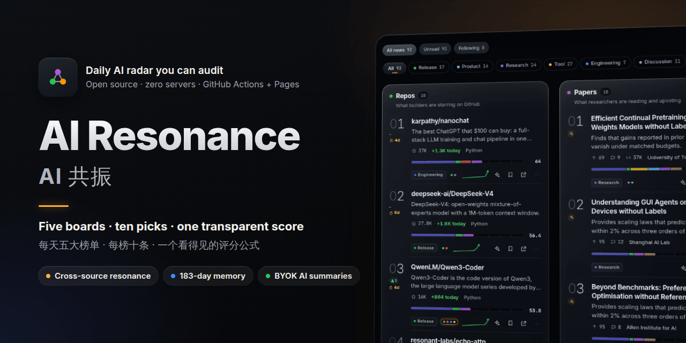
</p>

<h1 align="center">AI Resonance</h1>

<p align="center">
  <b>The daily AI radar you can audit.</b><br>
  Read the day's meaningful events, explore five transparent boards, or start with the beginner picks.<br>
  Original sources, explainable scores and six months of history. Open it and start reading.
</p>

<p align="center">
  <a href="https://github.com/WZZNNE/AI-Resonance/actions/workflows/ci.yml"></a>
  <a href="./LICENSE"></a>
  <a href="https://wzznne.github.io/AI-Resonance/"></a>
  <a href="https://github.com/WZZNNE/AI-Resonance/stargazers"></a>
  
</p>

<p align="center">
  <b>English</b> · <a href="./README.zh-CN.md">简体中文</a>
</p>

<p align="center">
  <a href="https://wzznne.github.io/AI-Resonance/">Read now</a> ·
  <a href="https://wzznne.github.io/AI-Resonance/#/learn">Beginner picks</a> ·
  <a href="https://wzznne.github.io/AI-Resonance/#/subscribe">Subscribe</a> ·
  <a href="#quick-start">Quick start</a> ·
  <a href="#feature-tour">Features</a> ·
  <a href="#make-it-your-radar-any-topic">Any topic</a> ·
  <a href="./docs/DEPLOY.md">Deploy</a> ·
  <a href="./docs/CHANNELS.md">MCP &amp; API</a> ·
  <a href="#faq">FAQ</a> ·
  <a href="./CONTRIBUTING.md">Contributing</a>
</p>

<p align="center">
  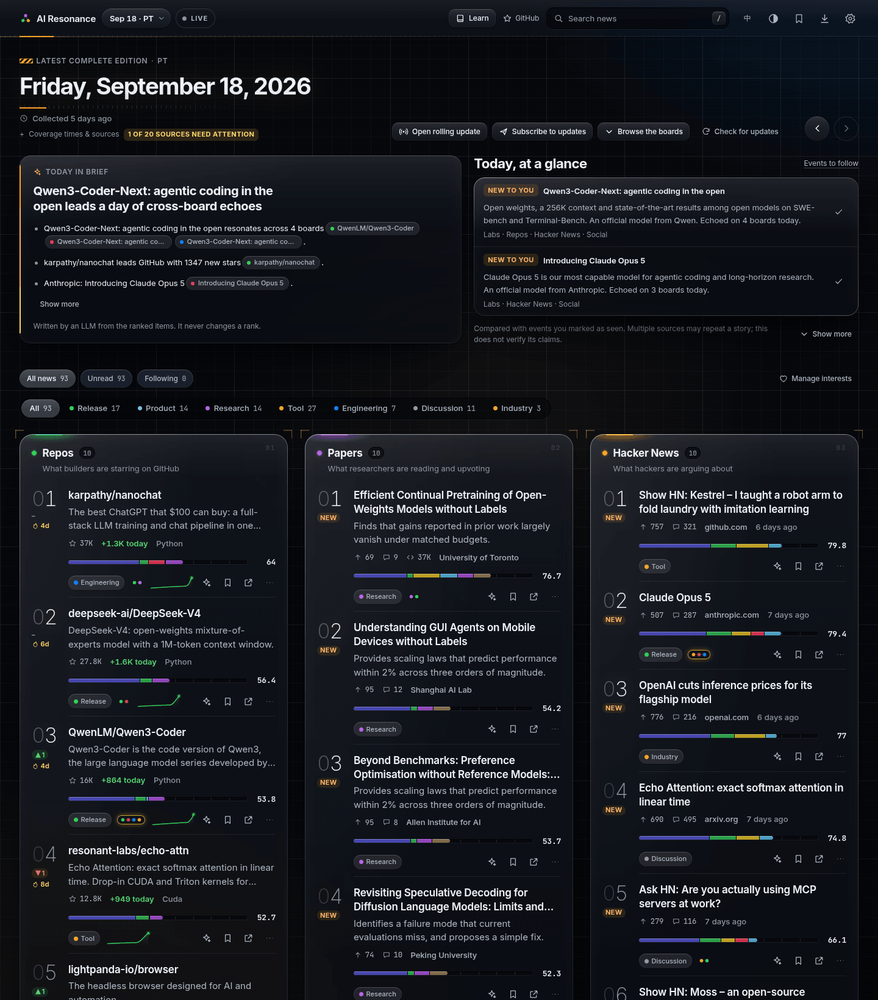
</p>

## Read it now — no deployment required

[Open the daily radar](https://wzznne.github.io/AI-Resonance/) · [Beginner picks](https://wzznne.github.io/AI-Resonance/#/learn) · [Subscribe](https://wzznne.github.io/AI-Resonance/#/subscribe)

The beginner library always shows 100 resources: 30 resident picks and 70 dynamic recommendations. Search by keyword and type, switch between resident and dynamic picks, or filter recent entries.

Reading, Atom subscriptions, follow controls, bookmarks and reading-library backup need no key or account. A site operator can pre-generate bilingual explanations with a pipeline LLM key; coverage is shown honestly when explanations are unavailable. Deploy only if you want to run your own edition.

## Update · 2026-09-21

The library always shows **100 resources: 30 resident picks plus 70 dynamic recommendations**. Dynamic selection is reconsidered daily; resources need not be newly published, and useful selections stay when no better candidates qualify.

- Removed historical launch news, specialist mathematics/research textbooks and duplicate repository/tutorial entry points. A few older foundations can remain when they still help users understand current tools.
- Dynamic selection considers useful AI tools, repositories, tutorials and official releases regardless of age. Ordinary research papers, rants, hiring, funding and promotions are excluded. A reviewed starter pool and retained candidates keep all 70 slots filled while later resources compete on value.
- Residents can be replaced. Rank all eligible candidates without reserved seats and use the 100th item's score as the daily threshold. A resident strictly below it can be replaced by the highest-scoring eligible resource that appeared in the dynamic 70 during the preceding 30 days and is not already resident. Equal scores do not trigger replacement.
- Source publication or repository update dates stay separate from entry dates. Recrawling old material does not make it new. `NEW` and `BACK` last seven days and entry history survives deployment.
- The page now prioritizes filters, short descriptions and source links. Long selection explanations, per-item recommendations and scoring details have moved out of the reading interface.

This revision retains 40 entries from the original catalogue and replaces 60, including all 15 original research papers and five historical launch stories, plus specialist or duplicate courses, textbooks and low-level library entries. New resources cover document Q&A, PDF/OCR, subtitles, speech, coding, workflows, visual creation and presentations. Examples include Claude Code, n8n, Docling, PaddleOCR, Subtitle Edit, Codex and Cherry Studio, plus ten official Chinese-language tool entry points. Paper and news categories may initially be empty; suitable later resources can still enter those categories.

The default GitHub Actions workflow collects and publishes every three hours, with extra runs around the daily cutoff. The visible page checks for updates every five minutes and supports manual refresh. This is scheduled refresh, not instant push. Initial resources receive editorial maintenance; dynamic selection and resident replacement use disclosed rules rather than individual editorial review. Missing translations fall back to the source text.

Internal learning scores combine foundation, clarity, practice and authority, each 0–5, multiplied by five. They support stable ordering and represent editorial/rule-based judgments, not popularity or measured learning outcomes. Monthly replacement uses the mean score on days a resource appeared in the dynamic selection during the past 30 days, recording each day once; ties compare current score, latest appearance and stable ID. Both a replacement's current score and monthly mean must exceed the displaced item's score. Missing days receive no invented scores; one observed day is enough to compete. The update rescreens cached candidates while preserving entry history. See [data and implementation notes](./docs/LEARNING.md).

The daily reader also gains clearer edition labels, content-first details, one-click follows, reading-library migration and a dedicated subscription page. Sharing now offers static preview pages and downloadable image cards. Explanation coverage and event changes are visible, so you can tell missing copy from missing source data. Details are in the [feature tour](#feature-tour).

## Why AI Resonance?

Most AI digests are a feed that someone (or some model) picked for you. You can't see why an item made the cut, you
only see one source at a time, and yesterday is gone. AI Resonance does it differently:

- **A score you can check.** Every rank has a published formula: named signals, weights, caps and curves in
  `config.yaml`. Tap any score bar to see raw value, normalised value and points. An LLM may write a blurb. It
  never decides the rank.
- **Cross-source resonance.** When the same repo, paper or launch shows up on GitHub, arXiv, Hacker News, X/Reddit and
  a lab's own blog on the same day, those items are linked into one cluster and shown first. Open the original
  sources to compare what each report supports.
- **Half a year of memory.** Every item keeps 183 days of history: first seen, days on board, streak, best rank,
  `NEW` / `▲3` / `▼1` / `BACK` badges and a sparkline. You can tell a one-day spike from a sustained trend.

It runs entirely on GitHub Actions and GitHub Pages. There is no backend, database or account. Daily explanations can be
pre-generated by the pipeline; optional personal AI tools run in your browser with your own keys. Change YAML to adapt
the daily sources and topic; the AI beginner catalogue is maintained separately.

## Screenshots

<table>
  <tr>
    <td width="50%" valign="top">
      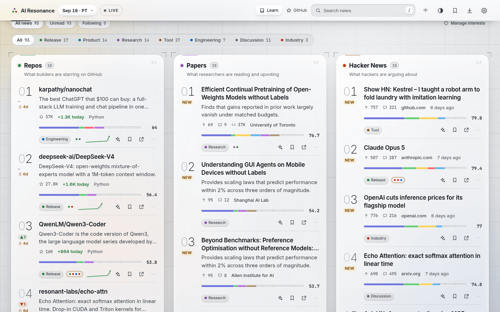
      <br><sub><b>Front page, light theme.</b> Category filter across all boards; every row shows its score bar.</sub>
    </td>
    <td width="50%" valign="top">
      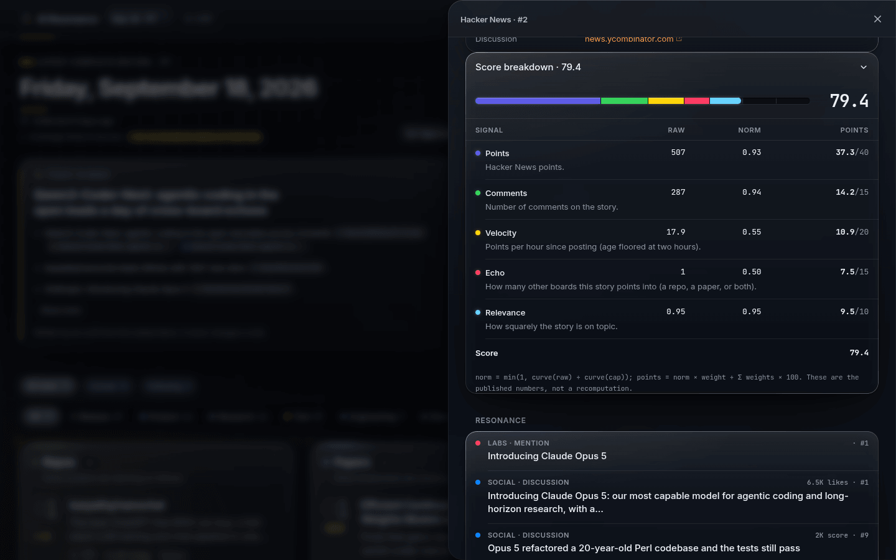
      <br><sub><b>Score breakdown.</b> Raw value, normalised value and points for each signal, plus the formula.</sub>
    </td>
  </tr>
  <tr>
    <td width="50%" valign="top">
      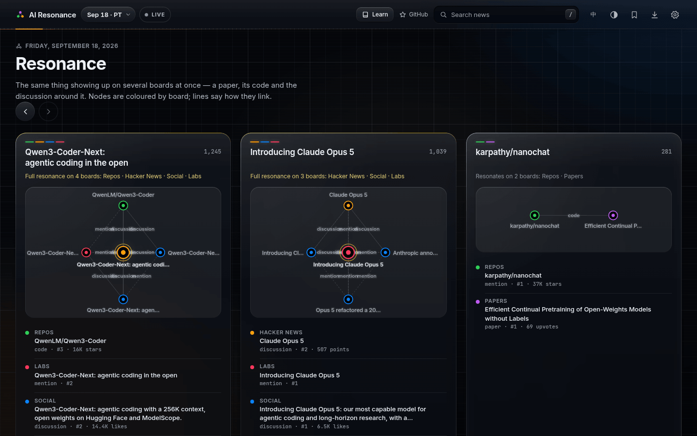
      <br><sub><b>Resonance.</b> One story on Repos, Hacker News and Social at once, with how each item links.</sub>
    </td>
    <td width="50%" valign="top">
      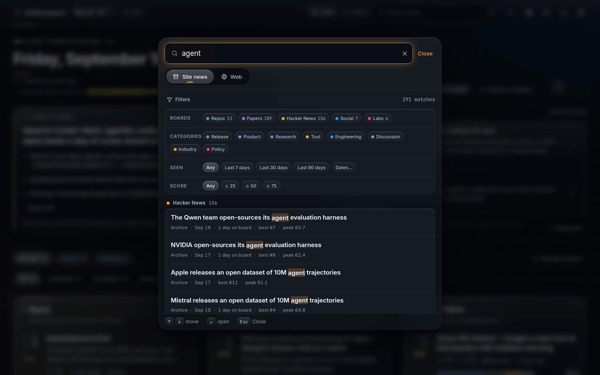
      <br><sub><b>Search.</b> <code>/</code> or Ctrl/⌘ K searches half a year in your browser, or the web.</sub>
    </td>
  </tr>
  <tr>
    <td width="50%" valign="top">
      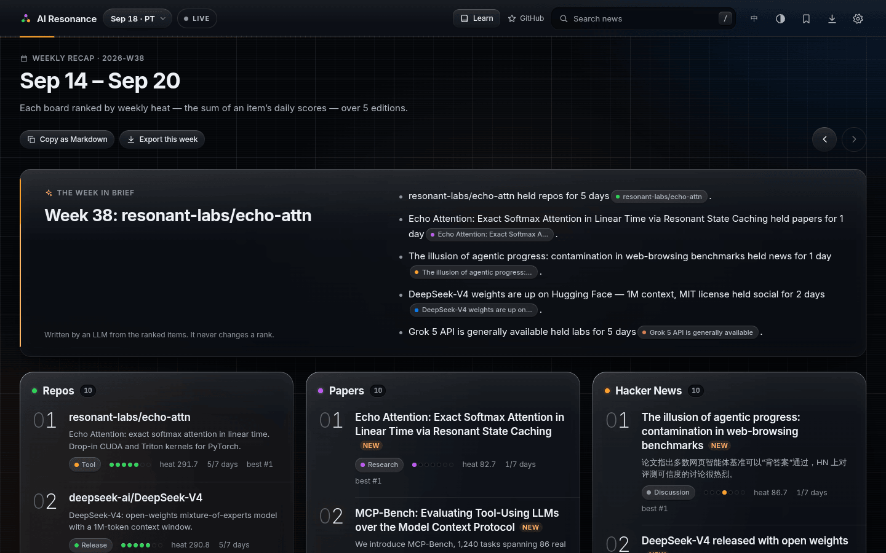
      <br><sub><b>Weekly recap.</b> Each ISO week ranked by weekly heat, with days on board and best rank.</sub>
    </td>
    <td width="50%" valign="top">
      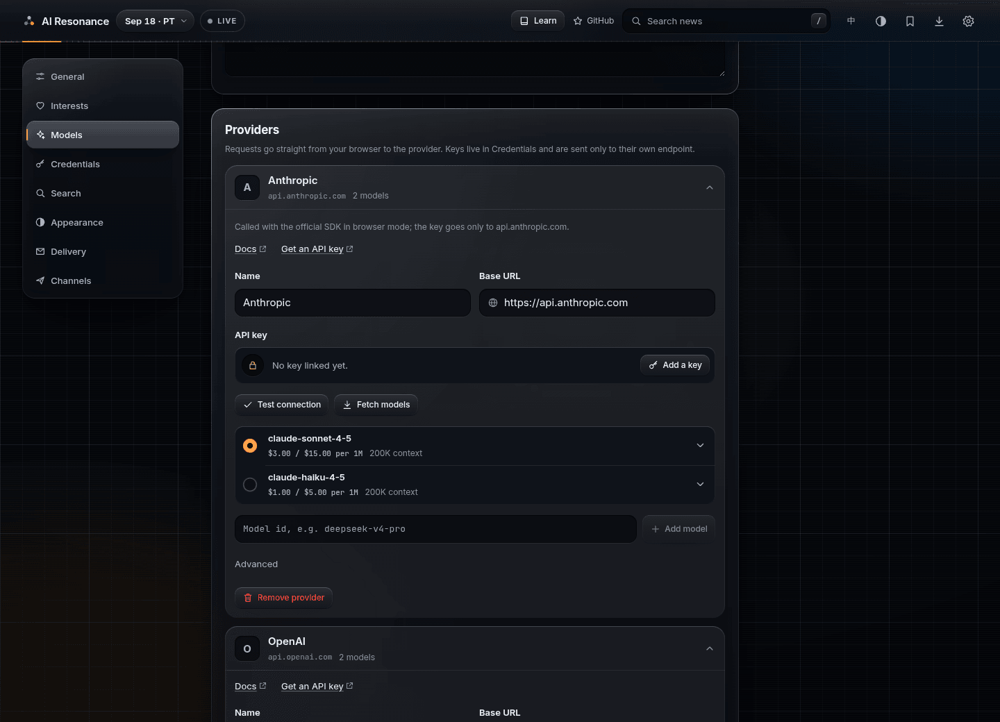
      <br><sub><b>Your models.</b> Live $/1M-token prices and the thinking-effort levels each model accepts.</sub>
    </td>
  </tr>
  <tr>
    <td width="50%" valign="top">
      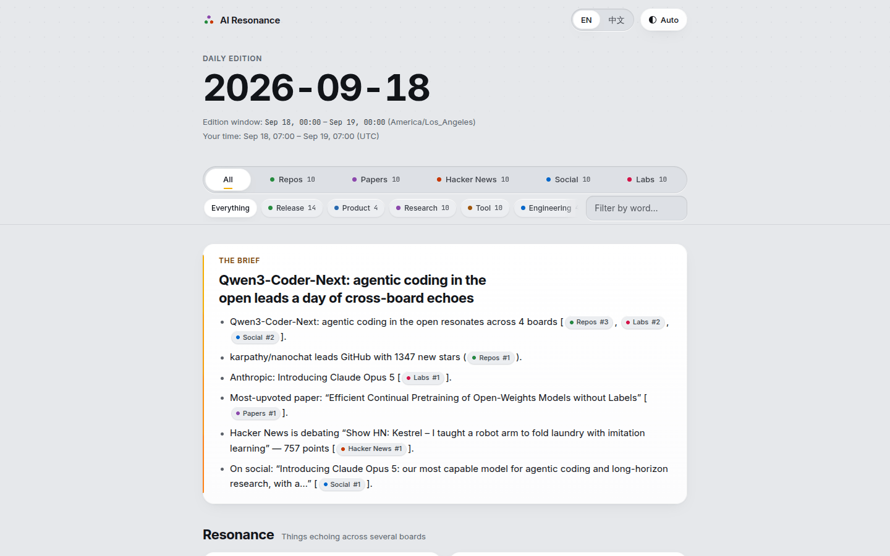
      <br><sub><b>Exported report.</b> One offline <code>.html</code> file with tabs, filters, language and theme switches.</sub>
    </td>
    <td width="50%" valign="top">
      <p align="center">
        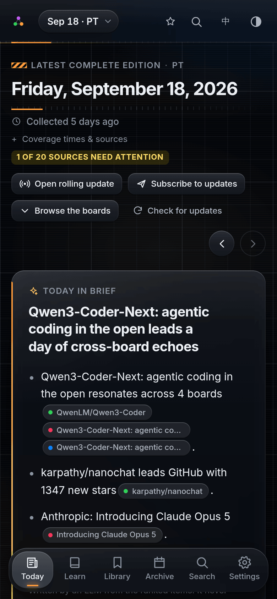
        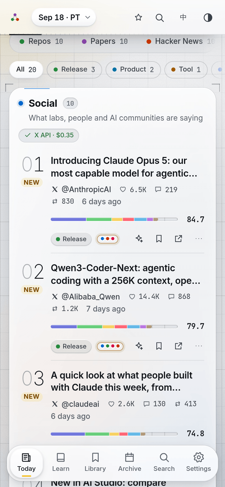
        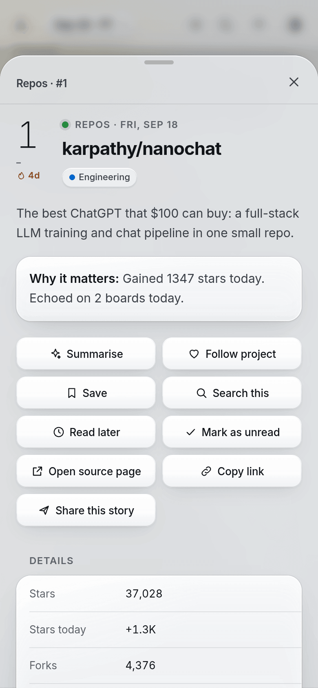
      </p>
      <sub><b>On a phone.</b> Swipe one board at a time; details open as a sheet. Installable as a PWA.</sub>
    </td>
  </tr>
</table>

## Feature tour

### Boards and ranking

- **Five boards, top 10 each** (plus 10 runners-up): Repos, Papers, Hacker News, Social (X + Reddit) and Labs
  (official AI-company updates). One shared, rule-based category bar (release · product · research · tool ·
  engineering · discussion · industry · policy) filters all of them.
- **Transparent heat score.** Signals, weights, caps and curves live in `config.yaml` and are published with the data.
  The **How scoring works** page shows the live weights and has a calculator. Ties break deterministically.
- **Resonance clusters.** Entity keys (`gh:owner/repo`, `arxiv:2609.20804`, `hn:…`, `rd:…`, `x:…`, `url:…`) are pulled
  from URLs, abstracts, READMEs and posts and joined into a graph. Echo counts in the score only as visible signals
  (`hn_echo`, `paper_echo`, `echo`), never as a hidden multiplier.
- **183-day trend memory.** Badges, streaks, best rank, sparklines and full rank history. Change a weight and the next
  run re-scores the whole half-year, so history always follows today's rules.
- **Honest source status.** Each board shows a chip when a source is degraded, failed or stale, instead of silently
  showing less.

### Reading experience

- **Read the event first.** A compact header distinguishes the latest complete edition from Live. Event cards show short summaries and group clear reports of the same event; casual conversation and promotions stay out of these picks without changing the five heat boards. Item details put the content before an expandable score breakdown.
- **Pick up where you left off.** Follow a project or company from its details, save an item, queue it for later or mark it read/unread. Event updates distinguish added sources from changed content. The local reading library exports to JSON and previews imports before merging them with existing saves.
- **Titanium × Signal UI, tactical glass.** Thick frosted-glass panels with real lighting (specular lip, refracting
  rim, depth shadows) over a lit tactical grid; HUD brackets that lock on, amber signal glow in the dark mode and an
  industrial safety-yellow light mode; panels power on and a scan line passes on every page change (reduced motion
  respected). Dark and light modes follow your system. Two alternate presets (`paper`, `terminal`), plus accent, density, font size,
  reduced motion, custom CSS and theme import/export. The visual spec is in [docs/VISUAL.md](./docs/VISUAL.md).
- **Phone and desktop.** A front-page grid on desktop, one swipeable board at a time on a phone, a floating tab bar,
  keyboard shortcuts (`/` search, `[` `]` previous/next edition). Installable as a PWA.
- **Bilingual, with visible coverage.** English and Chinese UI, plus operator-generated blurbs, "why it matters", essence points and daily briefs when configured. The page shows how many items have explanations and any known generation issue. Missing copy falls back to the original; readers need no key, and source links remain available.
- **Archive and weekly.** A calendar heat-map of the retention window where any day opens again, ISO-week recaps,
  and "longest on the boards".
- **Search that fits your habits.** Archive search runs offline in your browser (English prefix and Chinese substring
  matching, filters for board, date, score and resonance). The Web tab opens **Google · Bing · Baidu** with one tap.
  The default follows the UI language: Bing for Chinese, Google for English, and you can change it. Add a Tavily,
  Serper, Bocha, Jina or Firecrawl key, a self-hosted **SearXNG**, or any JSON search API (URL/body templates and
  dot-path result mapping), and results show inside the app and can feed summaries.

### Your AI (bring your own key)

- **Model manager.** Presets for Anthropic, OpenAI, DeepSeek, OpenRouter, Gemini, Qwen, GLM, Kimi, SiliconFlow, xAI,
  Mistral, Groq, **Ollama** and **LM Studio**, plus any OpenAI-compatible or Anthropic endpoint. It fetches the model
  list and matches **live $/1M-token prices** from a daily catalogue ([models.dev](https://models.dev), with LiteLLM
  as fallback). You can override any price.
- **Thinking effort.** One dial (`default · off · minimal · low · medium · high · xhigh · max`) is translated into each
  vendor's own request fields and limited to the levels the model supports.
- **"Is this worth my time?" in one click.** Your model streams a verdict card: TL;DR, three key points, who should
  care, caveats, and *Dig in / Bookmark / Skip*. Context is gathered in your browser (README, abstract, article text,
  top HN or Reddit comments). You see the estimated cost before and the actual cost after. Results are cached.
- **Credential vault.** One place for LLM, search, reader and GitHub keys: session-only, on-device, or on-device and
  encrypted (AES-GCM-256, PBKDF2-SHA256 with 310 000 iterations, auto-lock). Keys are masked, never exported by
  default, and there is a "wipe everything" button.

### Delivery

- **Website** on GitHub Pages (or a custom domain, or Cloudflare Pages).
- **Interactive report export.** One self-contained `.html` file for an edition, a week or a custom range of up to 31
  days: board tabs, category chips, a text filter, language and theme switches, optionally your own summaries. It
  works offline and from `file://`, and prints cleanly. The site also hosts reports for the newest 14 editions and
  8 weeks.
- **Scheduled e-mail through GitHub Actions.** Daily, weekly or both, at your local time, from your own mailbox (QQ,
  163, Gmail, any SMTP) or Resend. The mail carries the brief and the top 5 per board, with the report linked and
  attached. Set it up from **Settings › Delivery** with a token scoped to your repository. No workflow edits needed.
- **Subscribe without an account.** The subscription page provides Chinese and English Atom links to copy into your feed reader, alongside the Markdown digests. Scheduled e-mail remains an optional setup for the owner of a deployed copy.
- **Share an event.** Use your device's share menu or copy a link. Dated event and edition links have static summary pages with preview metadata and original sources. Download an image card generated in your browser as PNG, with SVG fallback when PNG export is unavailable.

### For agents and developers

- **MCP server** (stdio) with six tools: today's boards, archive search, entity history, resonance clusters, weekly
  recap and a ready-to-quote digest. **Settings › Channels** shows a copy-paste config with your site's URL filled in.
  To try it against the public instance from a local clone:

  ```bash
  claude mcp add ai-resonance --env RESONANCE_API=https://wzznne.github.io/AI-Resonance/api/v1 -- node <clone>/packages/channels/src/mcp.ts
  ```
- **dsh tool seam.** The same tools as raw JSON-Schema definitions for dsh plugins.
- **Static JSON API** at `/api/v1`: `manifest.json`, `daily/<date>.json`, `live.json`, `weekly/<week>.json`,
  `entities/…`, `search/index.json`, `pricing.json`, `report/…`, `digest.md`, `feed.xml`, plus `llms.txt`, and a
  typed client (`createClient`) in `@resonance/channels`.
- **Pluggable web app.** Features register routes, settings tabs, card actions and commands through one registry.
  Recipes for new sources, lab sites, languages, search engines and LLM presets are in
  [CONTRIBUTING.md](./CONTRIBUTING.md).

## How a score is made

```
norm   = min(1, curve(raw) / curve(cap))        curve: log (= ln(1+x)) · sqrt · linear
points = norm × weight / Σ weights × 100
total  = Σ points                               (packages/schema/src/score.ts)
```

A real example from the published data: the Hacker News story *"An empirical study of harness design for coding
agents"*, #2 on its board with **68.8**:

| Signal | Raw | Curve · cap | Norm | Points |
|---|---:|---|---:|---:|
| `points`: HN points at the latest reading | 205 | log · 800 | 0.797 | **31.9** / 40 |
| `comments`: HN comments | 57 | log · 400 | 0.677 | **10.2** / 15 |
| `velocity`: points per hour since posting | 12.6 | sqrt · 60 | 0.458 | **9.2** / 20 |
| `echo`: other boards its resonance cluster reaches | 1 | linear · 2 | 0.5 | **7.5** / 15 |
| `relevance`: how squarely on-topic | 1 | linear · 1 | 1 | **10.0** / 10 |
| **Total** | | | | **68.8** |

The `echo` points come from the paper behind the story, which is also on the Papers board that day. That link is what
puts both items into one resonance cluster. Every board has its own signal set; see the **How scoring works** page or
`boards:` in [`config.yaml`](./config.yaml).

## The five boards

| Board | Answers | Sources | Window |
|---|---|---|---|
| **Repos** | Which AI repos are builders starring? | GitHub Trending + GitHub Search API | star gain between two edition cutoffs |
| **Papers** | Which new papers are worth reading? | Hugging Face Daily Papers, arXiv, journal feeds (Nature MI, JMLR, JAIR) | edition |
| **Hacker News** | What are hackers discussing? | Algolia HN API | edition (story time) |
| **Social** | What are labs, key people and AI communities saying? | 11 AI subreddits; X: 17 official lab accounts free, the full 32-account watch list with an API key | edition (post time) |
| **Labs** | What did AI companies officially ship? | blogs, changelogs, release notes and GitHub/HF releases of 11 companies (Anthropic, OpenAI, Google, DeepSeek, xAI, Zhipu, Kimi, Qwen, Meta, Mistral, MiniMax) | 7-day look-back, `NEW` inside the edition |

Details and limits for every source: [docs/SOURCES.md](./docs/SOURCES.md).

## What "today" means: the edition window

An **edition** is a fixed time window, by default one full US-Pacific day: `[00:00, 24:00)` America/Los_Angeles (DST
days are correctly 23 or 25 hours). Each timestamped item (HN story, Reddit or X post, lab post, arXiv paper) is filed
under the edition its own publish time falls in. GitHub star gains are measured between two cutoffs. While an edition
is open, the site shows it as **Live**. At the cutoff it closes. `settleHours` later (8 by default) engagement is read
again, so late posts are judged fairly, and the edition is marked *settled*. Prefer a Beijing or New York day? Set
`edition.timezone` (and optionally `cutoff`) in `config.yaml`.

## Quick start

You need a GitHub account. Nothing else.

1. **Create your copy.** Click [**Use this template → Create a new repository**](https://github.com/WZZNNE/AI-Resonance/generate)
   and leave "Include all branches" unticked. (A fork works too, but forks start with Actions disabled.)
2. **Turn on Pages.** In your copy: **Settings → Pages → Build and deployment → Source: GitHub Actions.**
3. **Point the config at your copy.** The shipped `config.yaml` names this project and its demo site. In your copy,
   set `site.repoUrl` to your repository URL and `site.siteUrl` to `''` (CI then derives your Pages URL).
4. *(Optional)* Add secrets under **Settings → Secrets and variables → Actions**:

   | Secret | Turns on | Notes |
   |---|---|---|
   | `RESONANCE_LLM_API_KEY` (+ `RESONANCE_LLM_BASE_URL`, `RESONANCE_LLM_MODEL`) | bilingual blurbs, "why it matters", essence points, daily and weekly briefs | any OpenAI-compatible endpoint; default `https://api.deepseek.com` with the model in `config.yaml › enrich` |
   | `X_BEARER_TOKEN` | the whole X watch list through the official API | picked up automatically (`provider: auto`); without it only lab accounts are read, free |
   | `TWITTERAPI_IO_KEY` · `SOCIALDATA_API_KEY` | X through a cheaper unofficial provider | see the X row under [costs](#costs-and-limits-honest-version) |
   | `REDDIT_CLIENT_ID` + `REDDIT_CLIENT_SECRET` | Reddit with real votes and comment counts | needs an app Reddit has approved; otherwise RSS |
   | `MAIL_TO` + `SMTP_USER` + `SMTP_PASS` (or `RESEND_API_KEY`) | scheduled e-mail | plus the variable `RESONANCE_MAIL` (schedule as JSON); easier: let **Settings › Delivery** in the app write all of them |

5. **First run.** **Actions → Daily → Run workflow.** It creates the `data` branch, collects every source, publishes and
   deploys. The first run can take up to half an hour, mostly waiting on Reddit's RSS (about one request a minute).
   Your radar is then live at `https://<your-name>.github.io/<repo>/` and refreshes itself every three hours.

Exact menu paths, custom domains, Cloudflare Pages, e-mail setup and backfilling history:
[docs/DEPLOY.md](./docs/DEPLOY.md).

## Make it your radar (any topic)

The AI-specific parts are just data in [`config.yaml`](./config.yaml): keywords, GitHub topics, arXiv categories,
journal feeds, subreddits, X accounts and companies. Swap them and you have a daily radar for anything with GitHub
repos, papers and a community. A Rust radar, for example (edit these keys in place; keep every `sources.*` block):

```yaml
site:
  name: Rust Resonance
topic:
  strongKeywords: [rust, rustlang, cargo, tokio, wasm, webassembly]
  weakKeywords: [async, compiler, borrow, crate, memory safety]
  githubTopics: [rust, rust-lang, tokio, wasm, webassembly]
  domains: [rust-lang.org, blog.rust-lang.org, this-week-in-rust.org]
sources:
  arxiv: { enabled: true, categories: [cs.PL, cs.SE] }
  reddit: { subreddits: [{ name: rust }, { name: learnrust, weight: 0.6 }] }
  labs: { enabled: false, companies: {} }
```

The same file sets the score weights per board, the edition timezone, the retention window, the default theme and the
e-mail defaults. Scoring changes re-rank the whole history on the next run. Full reference and recipes:
[docs/CUSTOMIZE.md](./docs/CUSTOMIZE.md).

## Local development

Node ≥ 22.18 (24 recommended) and pnpm 11 (pinned in `package.json`).

```bash
pnpm i                    # install
pnpm daily                # collect → file into editions → rank → publish into ./data and packages/web/public/api/v1
pnpm dev                  # web app with hot reload on http://localhost:5173 (reads what `pnpm daily` published)
pnpm build                # production build → packages/web/dist
pnpm start                # built site + live API + CORS relay on http://127.0.0.1:4173 (run `pnpm build` first)
pnpm check                # pnpm lint + pnpm typecheck + pnpm test (Biome, tsc, Vitest), the same gate CI runs
pnpm pipeline --help      # run · publish · serve · backfill · doctor
pnpm pipeline doctor      # check Node, config.yaml, data, every source endpoint and optional keys
pnpm mcp                  # MCP server on stdio; needs RESONANCE_API (a URL) or RESONANCE_DIR (a folder)
pnpm mail --dry-run out --dir ../web/public/api/v1
                          # render the e-mail and the report into packages/channels/out/ instead of sending
```

Pass options straight after the script name, without a `--` separator (pnpm 11 would forward the `--` and the CLIs
reject it). Set `GITHUB_TOKEN` locally, since unauthenticated GitHub allows only 60 requests an hour. Every environment
variable is listed in [`.env.example`](./.env.example).

```
config.yaml              the one file a copy edits: topic, sources, weights, edition window, theme, e-mail defaults
packages/schema          data contract: types, entity keys, score maths, date helpers (zero dependencies)
packages/pipeline        sources → classify → link → editions → score + resonance + trend → enrich → publish
packages/web             static PWA (Vite + Preact): boards, resonance, archive, search, BYOK AI, vault, themes, export
packages/channels        API client, MCP server, dsh seam, report renderer, scheduled e-mail
.github/workflows        daily.yml (collect + deploy) · mail.yml (e-mail gate + send) · ci.yml (check + build)
docs/                    DESIGN · VISUAL · ARCHITECTURE · SOURCES · CHANNELS · DEPLOY · CUSTOMIZE · VERIFIED
```

## Costs and limits (honest version)

| What | Cost | Limits you will notice |
|---|---|---|
| Site, pipeline, e-mail sending | free in a **public** repo | In a *private* repo on the Free plan (2 000 min/month), the half-hourly mail check alone bills about 1 440 minutes a month. Keep the repo public, or disable the Mail workflow if you don't use e-mail. |
| Pipeline LLM copy (optional) | your provider's price | Each item is written once (cached by text hash), at most `enrich.maxItemsPerRun` per run. Without a key, cards show source text and there is no brief. |
| X | free for lab accounts; about **$20–30/month** for the full 32-account list on the official API | The free feed (`syndication`) is undocumented and only fresh for business-verified organisation accounts, so personal accounts need a key. twitterapi.io / SocialData cost about $3–10/month but are unofficial. `monthlyUsdCap` and `maxPostsPerRun` cap spending; also set a limit in console.x.com. X posts linked from HN, Reddit or lab pages are shown free. |
| Reddit | free | Without OAuth, Reddit is read over RSS: about 1 request/minute, **no vote counts** (posts rank by position in each community's Top-Today list, and the card says so), fetched at most every 6 h. Reddit sometimes blocks GitHub's runner IPs; the board then keeps its last good picks, marked stale. |
| Labs | free | x.ai blocks datacenter IPs with bot protection, so it is read through the `r.jina.ai` reader and marked *degraded*. China-hosted sites can be slow. Hugging Face and GitHub releases back up model launches. |
| Schedule | free | GitHub cron often runs 15 min to 2 h late and may drop runs at busy times. The pipeline decides from the clock, so late runs don't break anything. Mail has a 4-hour grace window. |
| Keep-alive | free | GitHub disables scheduled workflows after 60 days without activity in a public repo. Both workflows re-enable themselves every Monday; if one was disabled anyway, re-enable it in the Actions tab. |
| BYOK summaries and search | your own keys and prices | The summary sheet shows the estimated cost before a run and the actual cost after it. |

## Privacy and security

- **The site ships no secrets.** No backend, analytics, cookies or accounts: static files plus JSON.
- **Your reading library stays local.** Bookmarks, read state and follows stay in this browser. Explicit JSON export/import moves them between browsers; it is separate from ordinary settings backup and does not upload your library.
- **Your keys stay in your browser.** Summaries, model lists and search call the provider directly from your browser.
  All major hosted LLM providers allow this (CORS), so no proxy ever sees your key. A key is only sent to the
  endpoint it belongs to, and is never logged or exported by default.
- **Vault.** Each key lives where you choose: in memory for the session, in device storage, or in device storage
  encrypted with a passphrase (AES-GCM-256, PBKDF2-SHA256, auto-lock).
- **Shared `github.io` origin.** All project pages of one GitHub account share a browser origin. Use your own copy for
  BYOK (not someone else's demo) and prefer encrypted mode, or deploy to a custom domain or Cloudflare Pages.
- **Untrusted text stays text.** A strict CSP (`script-src 'self'`) applies. Titles, posts and LLM output render as
  text; the Markdown renderer is a safe subset with no raw HTML. Report files carry `default-src 'none'` and make no
  network requests.
- **Pipeline secrets** live in GitHub Actions secrets and are used only by the Daily and Mail jobs. Mail addresses are
  masked in logs and never written to published files.
- **Delivery tab.** Uses a fine-grained token for your repository only, stored in the vault. Mail secrets are
  encrypted in the browser (libsodium sealed box) before upload; the page can write them but never read them back.
- **Local relay** (`pnpm start`) listens on 127.0.0.1 only, forwards https to an explicit host allow-list, refuses
  private addresses and never forwards cookies.

## FAQ

**How is this different from GitHub Trending or an AI newsletter?** Trending pages show one source and forget
yesterday. Newsletters are curated by a person or a model you can't audit. AI Resonance reads many sources, links
what they have in common, ranks with a formula you can inspect, and keeps six months of history.

**Does an LLM pick the stories?** Daily heat ranks are calculated from published signals. With a key, an LLM writes
blurbs and the brief. Brief bullets must cite `board#rank`, and invalid citations are dropped. Event picks apply additional relevance rules; the beginner library uses the separate learning scores described above.

**Why does the Social board show mostly Reddit?** Without a key, X is read through a free feed that only covers the
official lab accounts. Add `X_BEARER_TOKEN` and the next run switches to the official API for the whole watch list.
X posts linked from HN, Reddit or lab pages always appear, free.

**Why does a Reddit card say "ranked by position" instead of showing votes?** Reddit's RSS carries no vote or comment
counts. The score then uses the post's place in its community's Top-Today list, and the card says so instead of
showing zeros.

**Why does the Labs board show posts from earlier in the week?** Official posts are sparse, so Labs looks back 7 days
and lets older posts fade (freshness halves every day). Posts from this edition are marked `NEW`.

**Why is an edition marked preliminary?** It has closed but not settled yet: engagement is re-read `settleHours` after
the cutoff. An e-mail sent before that carries the same banner.

**Can I use a local model?** Yes, with the Ollama and LM Studio presets. Ollama needs `OLLAMA_ORIGINS` set to your
site's origin; LM Studio needs "Enable CORS". Safari and iOS block plain-http loopback from an https page, so there run
`pnpm start` and open `http://127.0.0.1:4173`.

**How do I plug in my own SearXNG?** Pick the SearXNG engine in Settings › Search and enter its base URL. On the
SearXNG side, enable the `json` format and send an `Access-Control-Allow-Origin` header.

**Why is there no Bing *API* engine?** Microsoft retired the Bing Web Search API on 2025-08-11. Bing and Baidu open as
normal search pages in a new tab.

**I didn't get the e-mail.** Check spam, then the repository's Issues: a failed send opens an issue labelled
`mail-failure` with the error. **Actions → Mail → Run workflow** with `test` ticked sends one immediately.

**How big does the repository get?** The `data` branch keeps at most 60 raw candidates per board per edition and drops
snapshots older than 183 days, so a few MB. Everything under `/api/v1` is rebuilt from it on every run.

## Roadmap

- Ready-made topic presets (`config.yaml` variants for Rust, robotics, security …).
- More lab sites and journal feeds, contributed as small recipes.
- Reddit OAuth verified from GitHub's runners, for real vote counts.
- More UI languages (a language is one dictionary file).
- A long-running public demo with months of history.

Ideas and votes are welcome in [Issues](https://github.com/WZZNNE/AI-Resonance/issues).

## Contributing

Bug reports, new sources, lab recipes, translations and design polish are all welcome. Start with
[CONTRIBUTING.md](./CONTRIBUTING.md) (setup, dev loop, conventions and step-by-step recipes). The architecture is
described in [docs/ARCHITECTURE.md](./docs/ARCHITECTURE.md), the product contract in [docs/DESIGN.md](./docs/DESIGN.md)
and the visual language in [docs/VISUAL.md](./docs/VISUAL.md). Please run `pnpm check` before opening a pull request.

If AI Resonance saves you time, a star helps other people find it.

## Star history

<a href="https://star-history.com/#WZZNNE/AI-Resonance&Date">
  
</a>

## License

[MIT](./LICENSE). Data comes from GitHub, arXiv, Hugging Face, journal feeds, Hacker News, Reddit, X and the AI
companies' own sites, under their respective terms. Model prices come from [models.dev](https://models.dev) and
LiteLLM (both MIT).
