<p align="center">
  
</p>

<h1 align="center">AI Resonance · AI 共振</h1>

<p align="center">
  <b>一份排名经得起核查的每日 AI 雷达。</b><br>
  先读当天值得关注的事件，再按需看五类热榜；新人从「入门推荐」开始。<br>
  原始来源、透明评分、半年记忆，直接打开就能读。
</p>

<p align="center">
  <a href="https://github.com/WZZNNE/AI-Resonance/actions/workflows/ci.yml"></a>
  <a href="./LICENSE"></a>
  <a href="https://wzznne.github.io/AI-Resonance/"></a>
  <a href="https://github.com/WZZNNE/AI-Resonance/stargazers"></a>
  
</p>

<p align="center">
  <a href="./README.md">English</a> · <b>简体中文</b>
</p>

<p align="center">
  <a href="https://wzznne.github.io/AI-Resonance/">直接阅读</a> ·
  <a href="https://wzznne.github.io/AI-Resonance/#/learn">入门推荐</a> ·
  <a href="https://wzznne.github.io/AI-Resonance/#/subscribe">订阅</a> ·
  <a href="#五分钟上手">快速上手</a> ·
  <a href="#功能一览">功能</a> ·
  <a href="#改成你自己的雷达任意主题">任意主题</a> ·
  <a href="./docs/DEPLOY.md">部署</a> ·
  <a href="./docs/CHANNELS.md">MCP 与 API</a> ·
  <a href="#常见问题">常见问题</a> ·
  <a href="./CONTRIBUTING.md">参与贡献</a>
</p>

<p align="center">
  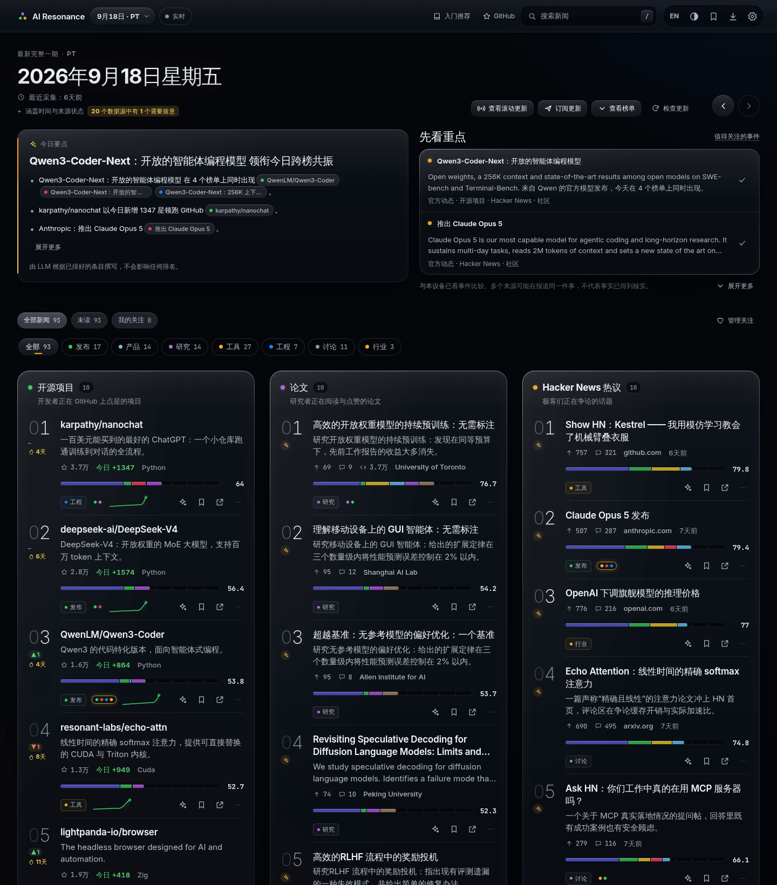
</p>

## 直接阅读，不需要部署

- [打开 AI 日报](https://wzznne.github.io/AI-Resonance/)：先看事件概要，再看开源项目、论文、新闻、社区和厂商榜单。
- [入门推荐](https://wzznne.github.io/AI-Resonance/#/learn)：每天固定 100 项，30 项常驻 + 70 项动态推荐；支持关键词、类型、常驻/动态和最近上榜筛选。
- [订阅日报](https://wzznne.github.io/AI-Resonance/#/subscribe)：中文/英文 Atom 订阅，不用注册账号；应用内收藏、稍后读、项目关注和阅读库导入导出也无需 Key。

想修改来源、主题或独立运营，再看[部署文档](./docs/DEPLOY.md)和下方开发步骤。站点运营者可配置流水线 LLM Key 为所有读者预生成双语解读；没有 Key 时仍能阅读原始内容和完整入门目录，页面会显示解读覆盖情况。

> 下文链接的 `docs/` 文档以英文为主；这一页已经涵盖上手所需的全部要点。

## 更新 · 2026-09-21

入门页每天固定显示 **100 项：30 项相对常驻 + 70 项动态推荐**。动态区每天重新评估，不要求资料都是最新发布，也不强行每天换完 70 项。没有更好的候选时继续保留已有实用内容。

- **删掉低频和重复入口。** 移除历史产品发布新闻、偏深的数学/研究教材，以及同一产品重复的仓库和教程。少量仍能帮助理解当前工具的基础资料可以保留，按实用性而非年份筛选。
- **动态区看实用价值。** 工具、开源项目、教程和有学习价值的官方发布都可入选，新旧不限；普通研究论文、吐槽、招聘、融资、促销不进入学习推荐。独立的实用资源启动库与历史候选池保证动态区始终有 70 项，后续按评分调整。
- **常驻也能淘汰。** 先对所有合格候选正常排序，以未施加常驻保护时的第 100 名为当日门槛。常驻项评分严格低于这条线时，从近 30 天进入过动态区的资源中，选择综合评分最高且不在常驻区的条目补入；相同分数不触发淘汰。这样既保持 30 项稳定入口，也不会保护已经落后的内容。
- **日期和新上榜分开。** 原始发布/项目更新时间与入榜时间分别记录，旧资料重新被抓取不会因此变成新品。首次入榜标 `NEW`，回归标 `BACK`，均显示 7 天；刷新与部署保留历史。
- **页面减负。** 保留搜索、分类、常驻/动态切换和简短简介，删除长篇选材介绍、逐条推荐理由和评分解释。这些规则集中写在这里，原始来源仍可直接打开。

本次保留旧目录中的 40 项，替换 60 项。移出的包括 15 篇原始研究论文、5 条历史发布新闻，以及偏深或重复的课程、教材、底层库入口；例如旧版 ChatGPT/Llama 2/Gemini 1.5 发布消息、CS229 等专项课程和概率机器学习教材。保留少量图解与概念资料，方便看懂当前工具。

新增入口主要覆盖文档问答、PDF/OCR、字幕与语音、AI 编程、工作流、图像视频和演示制作，包括 Claude Code、n8n、Docling、PaddleOCR、Subtitle Edit、Codex、Cherry Studio，以及 DeepSeek、Kimi、千问、豆包、腾讯元宝、智谱清言、MiniMax Agent、海螺、即梦、讯飞星火。初始 100 项中的新闻和论文可以暂时为空；后续有符合入门目的的内容仍能按对应类型入选。

默认 GitHub Actions 每 3 小时采集发布，并在日切窗口额外运行；页面在前台每 5 分钟检查数据，也支持手动刷新。调度可能延迟，不是秒级推送。初始资源由编辑维护，动态筛选与常驻替换按公开规则执行，不能替代人工质量核验。没有可用的中文解读时保留原文，不生成虚构译文。

内部学习分按基础性、清晰度、实践价值和来源各 0–5 分、合计乘 5，用于稳定排序；它是编辑与规则判断，不是 Star 排名或学习效果测量。近月综合分取过去 30 天入选日的学习分平均值，同一天更新多次只记一次；同分时依次比较当前分、最近入选日和稳定 ID。替补的当前分与近月均分均须高于被替换项，避免越换越差；没有历史的日期不补分，仅入选一天的资源也可参与。新版本沿用已有入榜历史，并重筛旧候选缓存。[开发与数据说明](./docs/LEARNING.md)。

这次也更新了日报阅读：区分完整一期与实时内容，详情先展示正文，支持一键关注、阅读库迁移和独立订阅入口。分享可生成静态摘要页面或下载图片卡片，解读覆盖与事件变化都有明确提示，方便区分“还没有解读”和“来源没有内容”。具体见[功能一览](#功能一览)。

## 为什么要做 AI 共振？

市面上的 AI 日报，大多是某个人（或某个模型）替你挑好的一串链接：你看不到某条内容凭什么入选，一次只看得到一个来源，
而且昨天的内容看完就没了。AI 共振换了一种做法：

- **分数可以核查。** 每个名次背后都有公开的公式：有名字的信号、权重、上限和曲线，全写在 `config.yaml` 里。
  点开任何一条的分数条，就能看到原始值、归一化值和得分。LLM 可以帮忙写简介，但**从不决定排名**。
- **跨源共振。** 同一个项目、同一篇论文、同一次发布，同一天出现在 GitHub、arXiv、Hacker News、X/Reddit 和官方博客上，
  这些条目会被串成一个“共振簇”，放在页面最前面，方便对照原文、判断各条消息的依据。
- **半年记忆。** 每个条目都保留 183 天的历史：首次出现、上榜天数、连续上榜、最佳名次、`NEW` / `▲3` / `▼1` / `BACK`
  标记和迷你走势图。一眼就能分清是昙花一现还是持续走热。

整个项目只跑在 GitHub Actions 和 GitHub Pages 上，没有后端、没有数据库、不需要注册账号。日报双语解读可由流水线预生成；
浏览器内的自由问答等个性化 AI 功能使用读者自己的 Key。改一个 YAML 文件可调整日报主题，AI 入门目录则独立维护。

## 界面截图

<table>
  <tr>
    <td width="50%" valign="top">
      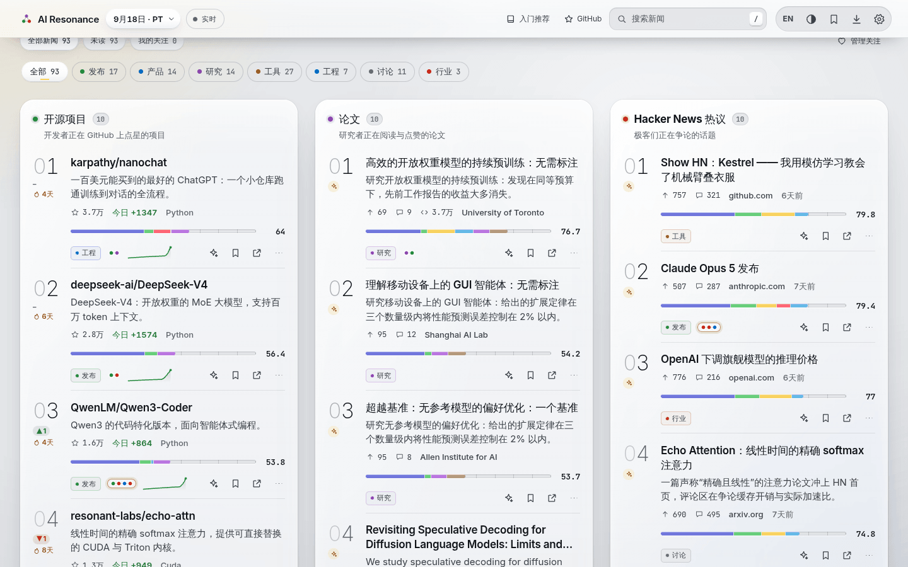
      <br><sub><b>首页（浅色）。</b>分类筛选作用于全部榜单，每一行都带着自己的分数条。</sub>
    </td>
    <td width="50%" valign="top">
      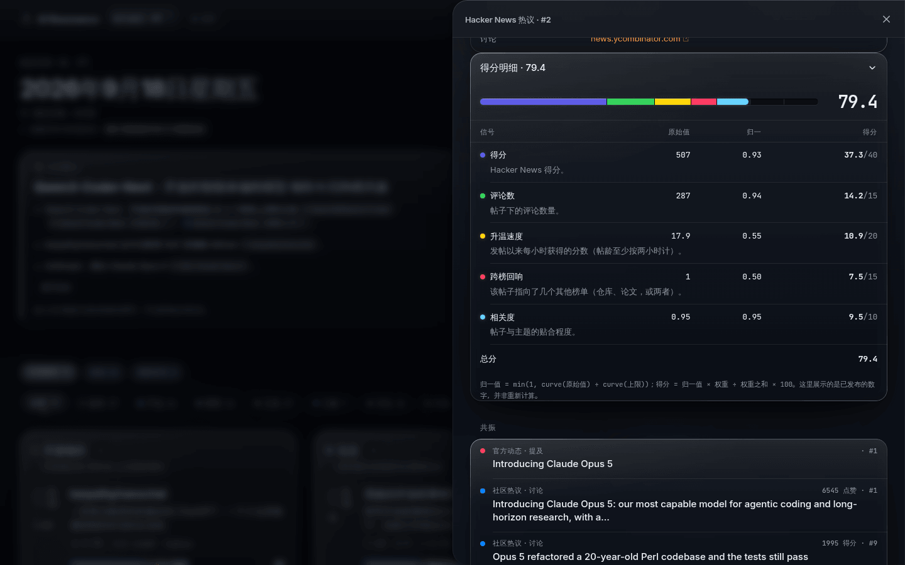
      <br><sub><b>得分明细。</b>每个信号的原始值、归一化值和得分，以及计算公式。</sub>
    </td>
  </tr>
  <tr>
    <td width="50%" valign="top">
      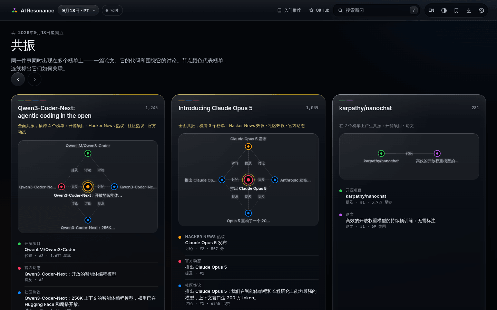
      <br><sub><b>共振。</b>同一件事同时登上开源项目、HN 和社区动态三个榜单，以及它们之间怎么关联。</sub>
    </td>
    <td width="50%" valign="top">
      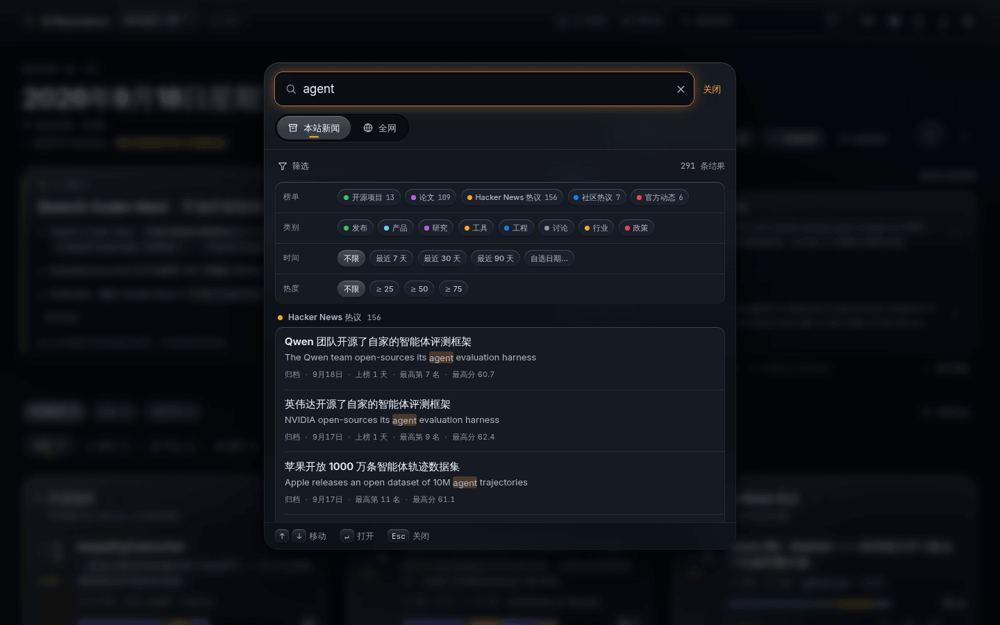
      <br><sub><b>搜索。</b>按 <code>/</code> 或 Ctrl/⌘ K，在浏览器里检索半年的归档，或一键跳转全网搜索。</sub>
    </td>
  </tr>
  <tr>
    <td width="50%" valign="top">
      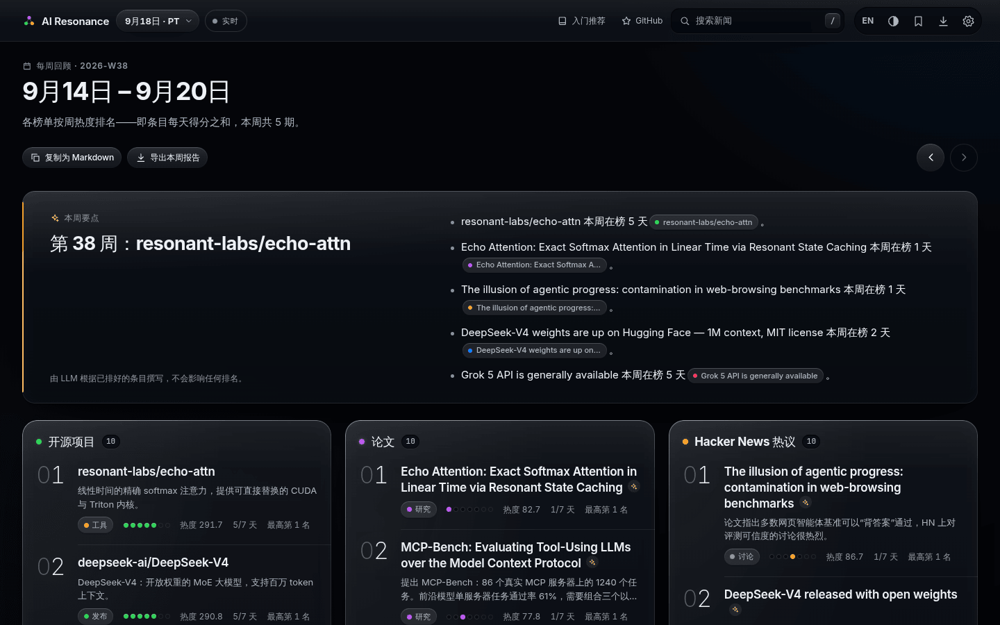
      <br><sub><b>每周回顾。</b>每个 ISO 周按周热度排序，附上榜天数和最佳名次。</sub>
    </td>
    <td width="50%" valign="top">
      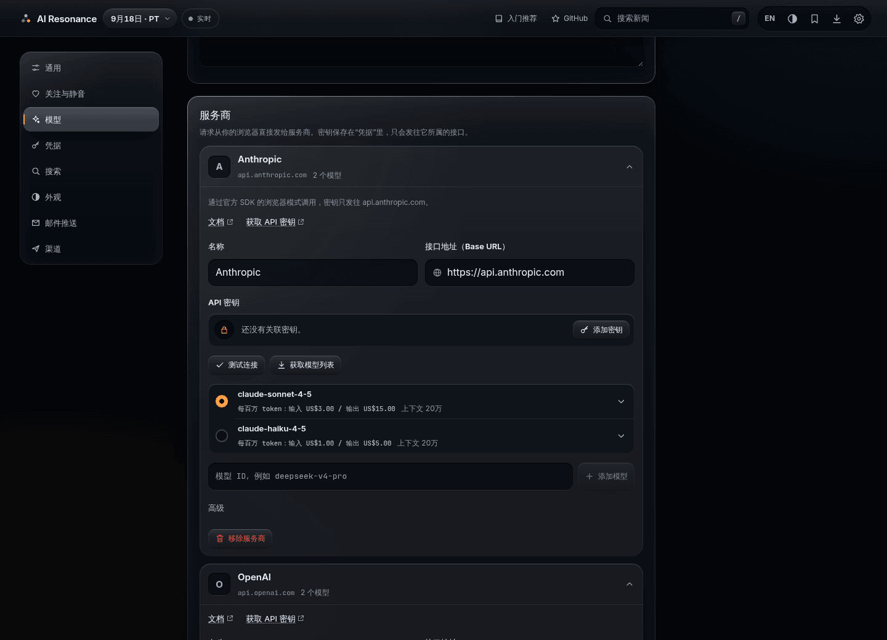
      <br><sub><b>你的模型。</b>实时的每百万 token 价格，以及每个模型支持的思考强度档位。</sub>
    </td>
  </tr>
  <tr>
    <td width="50%" valign="top">
      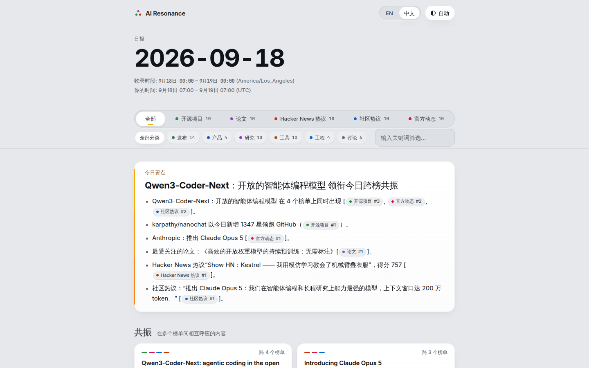
      <br><sub><b>导出报告。</b>一个可离线打开的 <code>.html</code> 文件，带榜单标签、筛选、中英和深浅色切换。</sub>
    </td>
    <td width="50%" valign="top">
      <p align="center">
        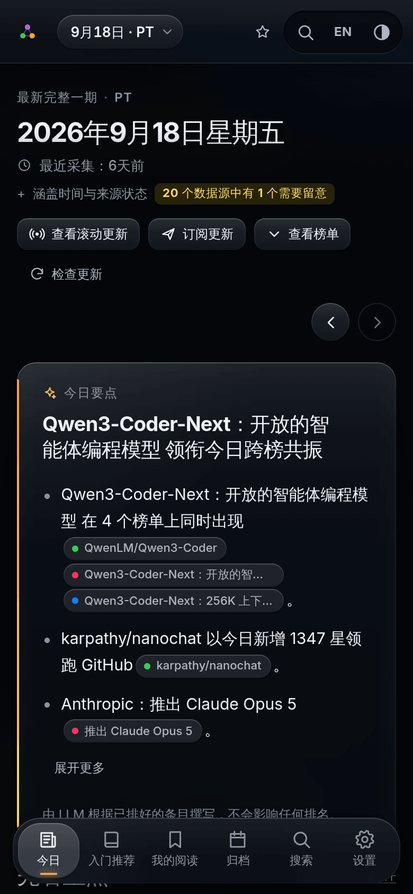
        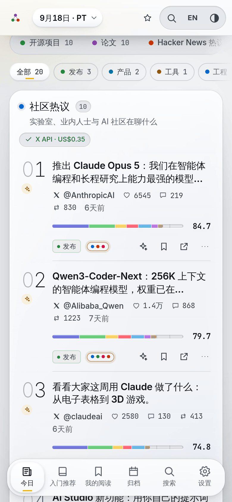
        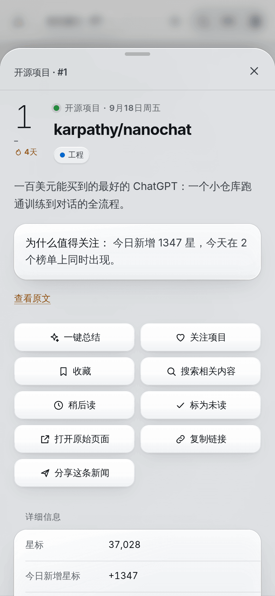
      </p>
      <sub><b>手机上。</b>左右滑动逐个切换榜单，详情以底部面板弹出；可以作为 PWA 安装到主屏。</sub>
    </td>
  </tr>
</table>

## 功能一览

### 榜单与排名

- **五个榜单，各取前十**（另附 10 条候补）：开源项目、论文、Hacker News 热议、社区动态（X + Reddit）、官方动态
  （各家 AI 公司的官方发布）。所有榜单共用一套基于规则的分类（发布 · 产品 · 研究 · 工具 · 工程 · 讨论 · 行业 · 政策），
  一个筛选栏就能同时作用于全部榜单。
- **透明热度分。** 信号、权重、上限和曲线都在 `config.yaml` 里，并随数据一起发布。“评分方法”页面展示当前权重，
  还带一个计算器。分数相同时按固定规则排序，结果完全确定。
- **共振簇。** 从链接、摘要、README 和帖子里提取实体 key（`gh:owner/repo`、`arxiv:2609.20804`、`hn:…`、`rd:…`、`x:…`、
  `url:…`），连成一张图。跨榜回响只以看得见的信号（`hn_echo`、`paper_echo`、`echo`）计入分数，从不暗中加权。
- **183 天趋势记忆。** 趋势标记、连续上榜、最佳名次、走势图和完整名次历史。改一个权重，下一次运行会把这半年全部按新规则
  重算，历史和今天永远用同一套规则。
- **数据源状态如实标注。** 某个来源降级、失败或数据过时，榜单上会出现状态标签，不会悄悄少显示几条。

### 阅读体验

- **先读事件，再看分数。** 首页用简短日期区分“最新完整一期”和“实时”，事件卡片展示概要、合并明确属于同一事件的报道；闲聊和促销不进入这些精选，五类热榜仍保留原始透明排名。详情先展示内容，评分明细按需展开。
- **接着上次继续读。** 在详情里一键关注项目或公司，收藏、加入稍后读、切换已读/未读。事件更新会区分“新增来源”和“内容变化”。阅读库支持导出 JSON；导入前预览数量，再与已有收藏合并。
- **Titanium × Signal 视觉（战术玻璃）。** 带顶光、边缘折射和投影厚度的毛玻璃面板，叠在一层柔和的场景光上；鼠标悬停时面板边框发光，深色是琥珀辉光，浅色是工业灰白配安全黄；面板“上电”入场、换页扫描线（尊重减少动效设置），深浅色跟随系统。另有 `paper`、`terminal`
  两套备选主题；强调色、信息密度、字号、减少动效都能调，还支持自定义 CSS 和主题导入导出。视觉规范见
  [docs/VISUAL.md](./docs/VISUAL.md)。
- **手机和电脑都好用。** 桌面端是报纸头版式的网格；手机上左右滑动逐个切换榜单，底部是悬浮标签栏。支持键盘快捷键
  （`/` 搜索，`[` `]` 切换上一期 / 下一期），可以作为 PWA 安装。
- **双语解读，覆盖可见。** 界面支持中英切换，运营者配置后可预生成简介、“为什么值得关注”、精华与每日要点。页面显示实际解读覆盖数量和已知生成问题；缺少解读时保留原文，普通读者不需要 Key，来源链接始终可打开。
- **归档与每周回顾。** 用日历热力图浏览整个保留期，任何一天都能重新打开；每个 ISO 周都有一份回顾，还有“上榜最久”排行。
- **顺手的搜索。** 站内归档搜索在浏览器里离线完成（英文前缀匹配 + 中文子串匹配，可按榜单、日期、分数、是否共振筛选）。
  “全网”标签一键跳转 **Google · Bing · 百度**；默认引擎跟随界面语言，中文界面用 Bing，英文界面用 Google，都可以改。
  填上 Tavily、Serper、博查、Jina 或 Firecrawl 的 Key，接入自建的 **SearXNG**，或者任何 JSON 搜索 API（URL 与请求体模板，
  结果用点路径映射），搜索结果就会直接显示在应用里，还能作为总结的参考资料。

### 你的 AI（自带 Key）

- **模型管理。** 内置 Anthropic、OpenAI、DeepSeek、OpenRouter、Gemini、通义千问、智谱 GLM、Kimi、硅基流动、xAI、Mistral、
  Groq、**Ollama**、**LM Studio** 的预设，也支持任何 OpenAI 兼容或 Anthropic 接口。能拉取模型列表，自动匹配每日更新的
  **每百万 token 价格**（来自 [models.dev](https://models.dev)，LiteLLM 兜底），价格也能手动覆盖。
- **思考强度。** 同一个档位（`default · off · minimal · low · medium · high · xhigh · max`）会自动换算成各家接口自己的参数，
  并限定在该模型支持的档位内。
- **一键判断“值不值得看”。** 你的模型会流式生成一张结论卡：一句话概括、三个要点、适合谁看、局限，以及“值得细看 / 先收藏 /
  可以跳过”的结论。上下文在浏览器里组装（README、摘要、正文、HN 或 Reddit 热门评论）；运行前显示预估费用，结束后显示实际
  费用，结果会缓存。
- **密钥保险箱。** LLM、搜索、阅读器和 GitHub 的 Key 统一管理：只存本次会话、存在本设备，或加密后存在本设备
  （AES-GCM-256，PBKDF2-SHA256 310 000 次迭代，自动锁定）。Key 始终脱敏显示，默认不随设置导出，还有“全部清除”按钮。

### 投递

- **网站**：部署在 GitHub Pages（也可以用自定义域名或 Cloudflare Pages）。
- **导出交互式报告**：把一期、一周或自选时段（最多 31 天）导出成一个独立的 `.html` 文件，带榜单标签、分类筛选、文字过滤、
  中英和深浅色切换，还可以附上你自己的总结。断网、直接双击 `file://` 打开都能用，打印也干净。网站本身还托管最近 14 期和
  8 周的报告。
- **用 GitHub Actions 定时发邮件**：每日、每周或两者都要，按你所在时区的时间，从你自己的邮箱（QQ、163、Gmail 或任意 SMTP）
  或 Resend 发出。邮件里有今日要点和每个榜单前 5 名，附带报告链接和附件。在应用的 **设置 › 邮件推送** 里用一个只作用于
  本仓库的令牌就能配好，不用改任何工作流文件。
- **免账号订阅**：独立订阅页提供中英 Atom 链接，可直接复制到阅读器，另有 Markdown 摘要。定时邮件是自己部署后可选的运营功能。
- **分享事件**：调用设备分享菜单或复制链接；具体日期的事件与日报链接提供静态摘要页，包含预览信息和原始来源。图片卡片在浏览器本地生成，支持下载 PNG；浏览器无法导出 PNG 时回退为 SVG。

### 面向智能体与开发者

- **MCP 服务器**（stdio），提供六个工具：今日榜单、归档搜索、条目历史、共振簇、周报和一份可直接引用的摘要。
  **设置 › 渠道** 里有填好本站地址、可直接复制的配置。在本地克隆里接上公开实例试试：

  ```bash
  claude mcp add ai-resonance --env RESONANCE_API=https://wzznne.github.io/AI-Resonance/api/v1 -- node <clone>/packages/channels/src/mcp.ts
  ```
- **dsh 工具接口**：同一套工具，以原始 JSON Schema 定义的形式提供给 dsh 插件。
- **静态 JSON API**（`/api/v1`）：`manifest.json`、`daily/<日期>.json`、`live.json`、`weekly/<周>.json`、`entities/…`、
  `search/index.json`、`pricing.json`、`report/…`、`digest.md`、`feed.xml`，以及 `llms.txt`；`@resonance/channels` 里
  还有带类型的客户端 `createClient`。
- **可插拔的网页应用。** 各功能通过同一个注册表挂载路由、设置页、卡片操作和命令。新增数据源、官方站点、界面语言、搜索引擎
  和 LLM 预设的步骤，都写在 [CONTRIBUTING.md](./CONTRIBUTING.md) 里。

## 分数是怎么算出来的

```
norm   = min(1, curve(raw) / curve(cap))        curve 取 log（= ln(1+x)）· sqrt · linear
points = norm × weight / Σ weights × 100
total  = Σ points                               （packages/schema/src/score.ts）
```

来自已发布数据的真实例子：Hacker News 帖子 *“An empirical study of harness design for coding agents”*，本期该榜第 2 名，
**68.8** 分：

| 信号 | 原始值 | 曲线 · 上限 | 归一化 | 得分 |
|---|---:|---|---:|---:|
| `points`：最近一次读取时的 HN 得分 | 205 | log · 800 | 0.797 | **31.9** / 40 |
| `comments`：HN 评论数 | 57 | log · 400 | 0.677 | **10.2** / 15 |
| `velocity`：发帖以来每小时得分 | 12.6 | sqrt · 60 | 0.458 | **9.2** / 20 |
| `echo`：所在共振簇还覆盖了几个其他榜单 | 1 | linear · 2 | 0.5 | **7.5** / 15 |
| `relevance`：与主题的贴合程度 | 1 | linear · 1 | 1 | **10.0** / 10 |
| **总分** | | | | **68.8** |

其中 `echo` 这一项，来自这篇帖子讨论的那篇论文：它当天也登上了论文榜。正是这条关联把两个条目串进了同一个共振簇。
每个榜单都有自己的一组信号，详见应用里的“评分方法”页面，或 [`config.yaml`](./config.yaml) 里的 `boards:`。

## 五个榜单

| 榜单 | 回答的问题 | 数据来源 | 时间窗口 |
|---|---|---|---|
| **开源项目** | 开发者们都在给哪些 AI 项目点星？ | GitHub Trending + GitHub 搜索 API | 两次截止之间的星标增量 |
| **论文** | 哪些新论文值得读？ | Hugging Face Daily Papers、arXiv、期刊订阅源（Nature MI、JMLR、JAIR） | 本期 |
| **Hacker News 热议** | 极客们在讨论什么？ | Algolia HN API | 本期（按发帖时间） |
| **社区动态** | 各家实验室、业内人士和 AI 社区在说什么？ | 11 个 AI 相关 subreddit；X：17 个官方实验室账号免费读取，配置 API Key 后覆盖完整的 32 个账号 | 本期（按发帖时间） |
| **官方动态** | AI 公司官方发布了什么？ | 11 家公司的博客、更新日志、发行说明和 GitHub/HF 发布（Anthropic、OpenAI、Google、DeepSeek、xAI、智谱、Kimi、通义千问、Meta、Mistral、MiniMax） | 回看 7 天，本期内发布的标 `NEW` |

每个数据源的细节与限制见 [docs/SOURCES.md](./docs/SOURCES.md)。

## “今天”指的是哪一段时间：一期的时间窗口

每一**期**是一段固定的时间窗口，默认是一个完整的美西自然日，即 America/Los_Angeles 时区的 `[00:00, 24:00)`（夏令时切换那天
是 23 或 25 小时，程序会正确处理）。带时间戳的条目（HN 帖子、Reddit / X 帖子、官方公告、arXiv 论文）按各自的发布时间归到对应
那一期；GitHub 星标增量按两次截止之间的差值计算。一期还没结束时，网站把它标为“**实时**”；到截止时刻它就关闭；再过
`settleHours`（默认 8 小时）会重读一遍互动数据，让晚发的帖子也能得到公平评价，随后这一期标记为“已定稿”。想按北京时间或
纽约时间切日？改 `config.yaml` 里的 `edition.timezone`（需要的话再改 `cutoff`）即可。

## 五分钟上手

只需要一个 GitHub 账号。

1. **创建你的副本。** 点 [**Use this template → Create a new repository**](https://github.com/WZZNNE/AI-Resonance/generate)，
   不要勾选 “Include all branches”。（fork 也可以，但 fork 出来的仓库默认关闭 Actions。）
2. **打开 Pages。** 在你的仓库里：**Settings → Pages → Build and deployment → Source** 选 **GitHub Actions**。
3. **让配置指向你的副本。** 仓库自带的 `config.yaml` 填的是本项目和它的演示站。在你的副本里，把 `site.repoUrl` 改成你的
   仓库地址，把 `site.siteUrl` 改成 `''`（留空后由 CI 自动推导你的 Pages 地址）。
4. （可选）在 **Settings → Secrets and variables → Actions** 里添加仓库机密：

   | 机密 | 开启的功能 | 说明 |
   |---|---|---|
   | `RESONANCE_LLM_API_KEY`（及 `RESONANCE_LLM_BASE_URL`、`RESONANCE_LLM_MODEL`） | 中英简介、“为什么值得关注”、精华要点、每日与每周要点 | 任何 OpenAI 兼容接口均可；默认 `https://api.deepseek.com`，模型见 `config.yaml › enrich` |
   | `X_BEARER_TOKEN` | 通过官方 API 读取完整的 X 关注名单 | 会被自动识别（`provider: auto`）；没有它时只免费读取官方实验室账号 |
   | `TWITTERAPI_IO_KEY` · `SOCIALDATA_API_KEY` | 通过更便宜的非官方渠道读取 X | 见[费用与限制](#费用与限制实话实说)里的 X 一行 |
   | `REDDIT_CLIENT_ID` + `REDDIT_CLIENT_SECRET` | 读取 Reddit 的真实投票数和评论数 | 需要一个经 Reddit 审批通过的应用；没有的话走 RSS |
   | `MAIL_TO` + `SMTP_USER` + `SMTP_PASS`（或 `RESEND_API_KEY`） | 定时邮件 | 另需仓库变量 `RESONANCE_MAIL`（JSON 格式的发信计划）；更省事的做法是让应用里的 **设置 › 邮件推送** 一次写好 |

5. **首次运行。** **Actions → Daily → Run workflow**。首次运行会创建 `data` 分支，抓取所有来源，然后发布并部署。第一次可能要
   半小时左右，主要是在等 Reddit 的 RSS（大约每分钟只允许一次请求）。之后你的雷达就在
   `https://<你的用户名>.github.io/<仓库名>/` 上线，此后每三小时自动更新一次。

每一步的具体菜单路径，以及自定义域名、Cloudflare Pages、邮箱设置和历史数据回填，见 [docs/DEPLOY.md](./docs/DEPLOY.md)。

## 改成你自己的雷达（任意主题）

和 AI 相关的部分只是 [`config.yaml`](./config.yaml) 里的数据：关键词、GitHub topic、arXiv 分类、期刊订阅源、subreddit、
X 账号和公司列表。把它们换掉，就得到一份新主题的每日雷达，只要这个领域有 GitHub 项目、论文和社区讨论。比如 Rust 雷达（在原处修改这些键，每个 `sources.*` 块都要保留）：

```yaml
site:
  name: Rust Resonance
topic:
  strongKeywords: [rust, rustlang, cargo, tokio, wasm, webassembly]
  weakKeywords: [async, compiler, borrow, crate, memory safety]
  githubTopics: [rust, rust-lang, tokio, wasm, webassembly]
  domains: [rust-lang.org, blog.rust-lang.org, this-week-in-rust.org]
sources:
  arxiv: { enabled: true, categories: [cs.PL, cs.SE] }
  reddit: { subreddits: [{ name: rust }, { name: learnrust, weight: 0.6 }] }
  labs: { enabled: false, companies: {} }
```

同一个文件还管着每个榜单的计分权重、每期的时区、保留天数、默认主题和邮件默认值。计分方面的修改，下一次运行时会重算全部
历史。完整的配置说明和更多示例见 [docs/CUSTOMIZE.md](./docs/CUSTOMIZE.md)。

## 本地开发

需要 Node ≥ 22.18（推荐 24）和 pnpm 11（具体版本写在 `package.json` 里）。

```bash
pnpm i                    # 安装依赖
pnpm daily                # 抓取 → 归入各期 → 排名 → 发布到 ./data 和 packages/web/public/api/v1
pnpm dev                  # 带热更新的网页，http://localhost:5173（读取 pnpm daily 发布的数据）
pnpm build                # 生产构建 → packages/web/dist
pnpm start                # 在 http://127.0.0.1:4173 提供构建好的网站、实时 API 和 CORS 中转（先运行 pnpm build）
pnpm check                # pnpm lint + pnpm typecheck + pnpm test（Biome、tsc、Vitest），和 CI 完全一致
pnpm pipeline --help      # run · publish · serve · backfill · doctor
pnpm pipeline doctor      # 检查 Node、config.yaml、本地数据、每个数据源接口和可选的 Key
pnpm mcp                  # stdio 上的 MCP 服务器；需要设置 RESONANCE_API（网址）或 RESONANCE_DIR（本地目录）
pnpm mail --dry-run out --dir ../web/public/api/v1
                          # 不发送，把邮件和报告渲染到 packages/channels/out/
```

选项直接跟在脚本名后面，不要加 `--` 分隔符（pnpm 11 会把 `--` 原样传给脚本，导致选项被拒绝）。本地运行最好设置
`GITHUB_TOKEN`，因为未登录的 GitHub 每小时只允许 60 次请求。全部环境变量列在 [`.env.example`](./.env.example) 里。

```
config.yaml              副本唯一需要改的文件：主题、数据源、权重、每期窗口、外观、邮件默认值
packages/schema          数据契约：类型、实体 key、计分公式、日期工具（零依赖）
packages/pipeline        抓取 → 分类 → 关联 → 归期 → 计分 + 共振 + 趋势 → 文案 → 发布
packages/web             静态 PWA（Vite + Preact）：榜单、共振、往期、搜索、自带 Key 的 AI、保险箱、主题、导出
packages/channels        API 客户端、MCP 服务器、dsh 接口、报告渲染、定时邮件
.github/workflows        daily.yml（抓取 + 部署）· mail.yml（发信判断 + 发送）· ci.yml（检查 + 构建）
docs/                    DESIGN · VISUAL · ARCHITECTURE · SOURCES · CHANNELS · DEPLOY · CUSTOMIZE · VERIFIED
```

## 费用与限制（实话实说）

| 项目 | 费用 | 你会遇到的限制 |
|---|---|---|
| 网站、流水线、发邮件 | **公开**仓库免费 | 如果是 Free 计划下的*私有*仓库（每月 2 000 分钟），光是每半小时一次的发信检查每月就要计费约 1 440 分钟。建议保持仓库公开；不用邮件的话，在 Actions 页面停用 Mail 工作流。 |
| 流水线 LLM 文案（可选） | 按你的服务商计价 | 每个条目只生成一次（按文本哈希缓存），每次运行最多 `enrich.maxItemsPerRun` 条。没有 Key 时卡片显示原文，也没有今日要点。 |
| X | 官方实验室账号免费；用官方 API 读完整的 32 个账号每月约 **20–30 美元** | 免费通道（`syndication`）没有官方文档，只对企业认证的机构账号是新鲜的，所以个人账号需要 Key。twitterapi.io / SocialData 每月约 3–10 美元，但属于非官方渠道。`monthlyUsdCap` 和 `maxPostsPerRun` 会兜底控制花费，也记得在 console.x.com 设置消费上限。HN、Reddit 或官方页面里链接到的 X 帖子始终免费显示。 |
| Reddit | 免费 | 没有 OAuth 时走 RSS：大约每分钟一次请求，**没有投票数**（帖子按它在所属社区“今日最热”列表里的位置排名，卡片上会注明），最多每 6 小时抓一次。Reddit 有时会封禁 GitHub 的机房 IP，这时榜单保留上一次成功的内容，并标为“过时”。 |
| 官方动态 | 免费 | x.ai 对机房 IP 启用了反爬防护，改经 `r.jina.ai` 阅读器读取并标为“降级”；国内托管的网站可能较慢。Hugging Face 和 GitHub 的发布记录会作为模型发布的兜底来源。 |
| 定时任务 | 免费 | GitHub 的 cron 经常晚 15 分钟到 2 小时以上，高峰期还会丢任务。流水线按实际时钟决定该做什么，晚跑不会出错；邮件有 4 小时的宽限窗口。 |
| 保活 | 免费 | 公开仓库 60 天没有活动，GitHub 会停用定时工作流。两个工作流每周一都会自动重新启用自己；万一还是被停用，到 Actions 页面手动启用即可。 |
| 浏览器里的总结与搜索 | 用你自己的 Key，按各家价格计费 | 总结面板会在运行前显示预估费用，运行后显示实际费用。 |

## 隐私与安全

- **网站本身不带任何密钥。** 没有后端、统计、Cookie 或账号，只有静态文件和 JSON。
- **阅读库留在本地。** 收藏、已读状态和关注保存在当前浏览器；主动导出/导入 JSON 才会迁移到其他浏览器。阅读库备份独立于普通设置备份，不会上传到服务器。
- **Key 只留在你的浏览器里。** 总结、模型列表和搜索都由浏览器直接请求服务商。主流云端 LLM 服务商都允许这样调用（CORS），
  所以你的 Key 不会经过任何代理。每个 Key 只发往它所属的接口，不写日志，默认也不会导出。
- **保险箱。** 每个 Key 存在哪里由你决定：只在本次会话的内存里、存在本设备，或用口令加密后存在本设备
  （AES-GCM-256，PBKDF2-SHA256，自动锁定）。
- **`github.io` 同源问题。** 同一个 GitHub 账号下的所有项目页面共用一个浏览器源。要在网页里用自己的 Key，请部署你自己的副本
  （不要用别人的演示站），并优先使用加密模式；更稳妥的是用自定义域名或 Cloudflare Pages。
- **不可信的文本只当文本显示。** 页面启用严格的 CSP（`script-src 'self'`）；标题、帖子和 LLM 输出都按纯文本渲染，Markdown
  渲染器只支持安全子集，不允许原始 HTML。报告文件带 `default-src 'none'`，不会发出任何网络请求。
- **流水线机密**保存在 GitHub Actions secrets 里，只有 Daily 和 Mail 两个任务会用到。邮箱地址在日志里会被遮住，也从不写进
  发布出去的文件。
- **邮件推送设置页**使用一个只作用于本仓库的细粒度令牌，存在保险箱里。邮件相关的机密先在浏览器里用 libsodium sealed box
  加密再上传；页面只能写入，永远读不回来。
- **本地中转**（`pnpm start`）只监听 127.0.0.1，只把 https 请求转发到明确列出的主机，拒绝一切内网地址，也从不转发 Cookie。

## 常见问题

**它和 GitHub Trending、AI 日报有什么不同？** 热榜只看一个来源，看完就忘；日报由某个人或某个模型挑选，你没法核查。
AI 共振同时读很多来源，把它们的交集串起来，用一个你能检查的公式排名，并且记住半年的历史。

**是 LLM 在挑内容吗？** 日报热榜按公开信号计算排名。配置了 Key 时，LLM 负责写简介和今日要点；要点里的每一条都必须
注明出处 `榜单#名次`，无效出处会被丢弃。事件精选另做相关性筛选，入门推荐则使用上文说明的独立学习分。

**社区动态榜单里为什么大多是 Reddit？** 没有 Key 时，X 走一个免费通道，只覆盖官方实验室账号。加上 `X_BEARER_TOKEN`，
下一次运行就会自动改用官方 API 读取完整的关注名单。HN、Reddit 或官方页面里链接到的 X 帖子，无论如何都会免费显示。

**为什么 Reddit 卡片写着“按位置排名”，没有投票数？** Reddit 的 RSS 里没有投票数和评论数。这时分数按帖子在所属社区“今日最热”
列表里的名次计算，卡片会如实说明，而不是显示一串 0。

**官方动态里为什么有几天前的内容？** 官方发布本来就少，所以这个榜单回看 7 天，旧内容的新鲜度每天减半、逐渐下沉；本期内
发布的会标 `NEW`。

**为什么某一期标着“初步”？** 这一期已经结束但还没定稿：截止后过 `settleHours` 小时才会重读互动数据。在这之前发出的邮件也会
带同样的提示。

**能用本地模型吗？** 可以，用 Ollama 或 LM Studio 预设。Ollama 需要把 `OLLAMA_ORIGINS` 设为你网站的源；LM Studio 要打开
“Enable CORS”。Safari 和 iOS 不允许 https 页面访问 http 的本机地址，这时运行 `pnpm start`，再打开 `http://127.0.0.1:4173`。

**怎么接入自己的 SearXNG？** 在 设置 › 搜索 里选择 SearXNG 引擎，填上它的地址即可。SearXNG 那边要开启 `json` 格式，并返回
`Access-Control-Allow-Origin` 响应头。

**为什么没有 Bing 的 *API* 搜索？** 微软已于 2025-08-11 停用 Bing Web Search API。Bing 和百度都是在新标签页里直接打开搜索
结果页。

**没收到邮件？** 先看垃圾邮件箱，再看仓库的 Issues：发送失败时会自动开一个带 `mail-failure` 标签的 issue，里面有错误信息。
在 **Actions → Mail → Run workflow** 里勾选 `test`，可以立刻发一封测试邮件。

**仓库会越来越大吗？** `data` 分支每期每个榜单最多保留 60 个原始候选，超过 183 天的快照会自动删除，总共也就几 MB。
`/api/v1` 下的所有文件每次运行都会从这些快照重新生成。

## 路线图

- 现成的主题预设（Rust、机器人、安全等方向的 `config.yaml` 变体）。
- 更多官方站点和期刊订阅源，以小的“配方”形式贡献进来。
- 验证 Reddit OAuth 在 GitHub 运行器上的可用性，拿到真实投票数。
- 更多界面语言（新增一种语言只需要一个词典文件）。
- 一个长期运行、积累了数月历史的公开演示站。

欢迎在 [Issues](https://github.com/WZZNNE/AI-Resonance/issues) 里提想法、投票。

## 参与贡献

欢迎提交 bug、新数据源、官方站点配方、翻译和设计打磨。先读 [CONTRIBUTING.md](./CONTRIBUTING.md)（环境搭建、开发流程、
约定和分步配方）。架构说明见 [docs/ARCHITECTURE.md](./docs/ARCHITECTURE.md)，产品契约见 [docs/DESIGN.md](./docs/DESIGN.md)，
视觉语言见 [docs/VISUAL.md](./docs/VISUAL.md)。提交 PR 前请先跑一遍 `pnpm check`。

如果 AI 共振帮你省了时间，点个 Star 能让更多人发现它。

## Star 趋势

<a href="https://star-history.com/#WZZNNE/AI-Resonance&Date">
  
</a>

## 许可证

[MIT](./LICENSE)。数据来自 GitHub、arXiv、Hugging Face、各期刊订阅源、Hacker News、Reddit、X 以及各 AI 公司的官网，
分别遵循各自的使用条款。模型价格来自 [models.dev](https://models.dev) 和 LiteLLM（均为 MIT 许可）。
